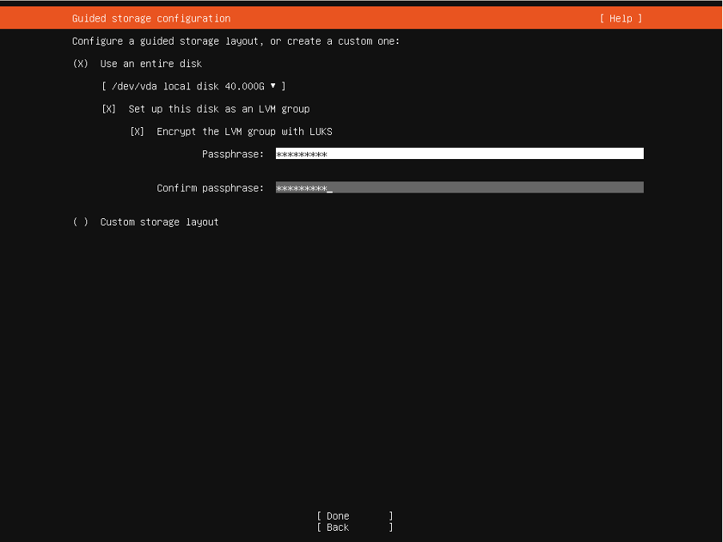
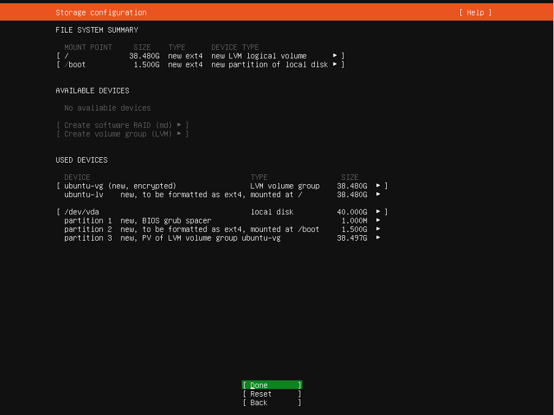
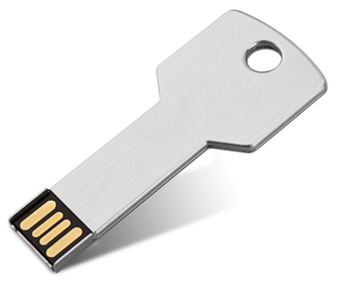

# Procedimento para Cifra do disco de Servidores Ubuntu LTS nas Unidades Sanitárias
(Disk encryption and decryption using USB drive for Health Facilities - Procedure in Portuguese)

## Introdução

Os servidores nas Unidades Sanitárias que têm o Sistema Operativo Ubuntu LTS são normalmente os sistemas que albergam as aplicações e bases de dados mais importantes - dados de
pacientes. Assim é muito importante que estejam instalados de forma a garantirem a melhor segurança e proteção de dados e isso implica que o disco esteja cifrado de forma a que os dados não sejam acedidos caso o servidor seja extraviado.

O objectivo deste procedimento é garantir que o disco dos servidores que armazenam os dados dos pacientes estejam cifrados e configurados de forma a facilitar a sua utilização pelos
intervenientes autorizados para tal, mas torne impossível a leitura dos dados para quem não está autorizado para tal, mantendo uma utilização facilitada do servidor em zonas remotas.

As palavras cifra e encriptação são sinónimas, mas neste documento iremos usar o termo cifra para designar o processo de máscara de dados em disco usando uma chave.

Qualquer esclarecimento adicional, poderá ser respondido pelo Responsável de Segurança do HIS.

Excepções a este procedimento terão de ser exclusivamente autorizadas pelo CDC.

## Configuração de cifra nos Servidores Ubuntu LTS

Para se configurar a cifra nos servidores, estes têm de ser reinstalados o que significa perder todas as aplicações e dados. Assim, antes de iniciar o processo de cifra do disco, tem de se:

1. Sincronizar o servidor com a Base de Dados provincial
2. Fazer backup dos dados de todas as aplicações do servidor
3. Testar todos os backups efectuados, fazendo restore e verificar os dados extraídos.
4. Reinstalar o servidor de acordo com os procedimentos indicados a seguir (com cifra habilitada no disco)
5. Reinstalar as aplicações que existiam no servidor
6. Repor os dados no servidor
7. Testar as aplicações e os dados das mesmas

Executar estes passos demora tempo, tempo esse em que o servidor estará indisponível. É extremamente importante coordenar previamente com as várias equipas que interagem com o servidor (digitação, muzima, idmed, etc), avisando as mesmas do tempo de paragem estimado.

## Distribuição Linux

A distribuição em uso para os servidores é Ubuntu Linux LTS. A versão exacta depende do parceiro, do tipo de servidor e aplicação a correr no servidor. É recomendável o uso da versão UBUNTU 22.04 LTS, visto que as versões anteriores deixaram de ter actualizações para novas versões de pacotes, estando restringidas a actualizações de segurança (https://ubuntu.com/about/release-cycle).

Os repositórios que devem ser utilizados nos servidores são o *main*, *restricted* e *universe*. A razão para restringir o uso do repositório *multiverse* (ver https://help.ubuntu.com/community/Repositories) é que contém software que não é gratuito, não garantindo por isso o cumprimento com as regras do MISAU (ministério da saúde).

Os servidores deverão ter os pacotes actualizados através da ferramenta ```apt update``` e ```apt upgrade```.

## Configuração da BIOS

A BIOS deve ser protegida com uma palavra-passe (respeitando as políticas de palavra-passe existentes), para a password de administração da BIOS.
O boot deve ser configurado para fazer apenas boot do disco rígido e retirar a possibilidade de fazer boot de dispositivos móveis.
É necessário garantir que todas as passwords habilitadas por defeito (SNMP, Acesso iLO, iDRAC, RSA2) sejam alteradas e deverão ser eliminados todas as contas e serviços que não sejam necessários.

## Configuração da cifra do disco

Para evitar perda de dados em caso de avaria do disco, é aconselhável que os servidores tenham no mínimo dois discos com RAID 1 configurado ou se o servidor tiver 3 ou mais discos deverá ter RAID 5 configurado, à excepção de servidores virtuais.

Deve-se preferir o RAID por *hardware*, por questões de performance, mas se o servidor não tiver uma placa de RAID, pode-se configurar o RAID por software no sistema operativo. Para mais informações sobre criação e gestão de Raids em software podem aceder à seguinte página: https://help.ubuntu.com/community/Installation/SoftwareRAID.

As partições devem ser baseadas em LVM (Logical Volume Manager) para permitir um posterior incremento ou decremento de espaço. Para mais informações sobre criação e gestão de Volume Groups podem aceder à seguinte página: https://ubuntu.com/server/docs/how-to-manage-logical-volumes.

Depois de escolher o disco a utilizar para a instalação, na altura de criação de um novo Volume Group (vg) deve escolher a cifra (escolhendo a opção “Encrypt the LVM group with LUKS”), de acordo com a imagem seguinte: 

Deverá escolher uma palavra-passe complexa (respeitando as políticas de palavra-passe existentes). É importante não esquecer a palavra-passe, no entanto, no dia a dia, será usada uma chave USB para desbloquear o disco. Esta palavra-passe poderá ser usada no caso em que as chaves USB estejam indisponíveis.

Após a criação dos Volume Groups, deverá verificar se o layout escolhido corresponde ao pretendido, nomeadamente no que concerne ao espaço de disco a utilizar.



Podem ser criados mais *Volume Groups* ou *Raids*, dependendo da configuração de discos do servidor. <ins>O que é importante de se garantir é que as partições que contém dados de pacientes estão cifradas (mesmo as partições que tenham backups que contenham informação de pacientes)</ins>.

Quando os discos são superiores a 100GB, a configuração de discos coloca o *Logical Volume principal* (ubuntu-lv) com 100GB e o restante espaço de disco fica disponível para ser adicionado posteriormente. Para se alocar todo o espaço do disco ao Logical Volume, deve-se navegar até ao ubuntu-lv, carregar em ENTER e editar o volume para se poder alocar todo o espaço de disco.

**Neste manual, para facilitar a instalação do sistema operativo, optou-se por cifrar todo o disco e colocar apenas uma partição que ocupa todo o disco.**

## Configuração de Chaves USB para desbloquear o disco

De forma a permitir maior facilidade no desbloqueio dos discos encriptados e sem necessidade de teclado e monitor, foram criados scripts que inicializam USBs com chaves criptográficas que sendo conectadas ao servidor, desbloqueiam o disco no arranque do servidor. 

Uma vez que o servidor tenha arrancado sem erros, <ins>esta chave deve ser desconectada do servidor e armazenada **num local seguro e separado do servidor** (por razões de segurança não deve permanecer no rack do servidor)</ins>. **Não se deve deixar a chave conectada no servidor.** A chave deve ser armazenada num local separado do servidor e apenas conectada ao servidor quando necessário para o desbloqueio do servidor no arranque do mesmo.

Por cada servidor deverão existir localmente duas chaves: uma que fica com o gestor da base de dados (ou quem o substitua) e outra com o gestor distrital (ou num escritório ou Unidade Sanitária distrital). 

Diariamente, aquando do início da actividade, o gestor de dados ou ponto focal deve conectar a chave USB no servidor e ligar o servidor. Após o correcto arranque do servidor, deverá retirar a chave USB do servidor e armazená-la em lugar seguro não próximo ao servidor - numa caixa-forte quando existir, ou caso não exista a caixa-forte, deverá guardar num local fechado com acesso restrito e controlado. Aconselha-se a produção de um procedimento para a gestão das chaves USB. 

Os scripts mencionados estão disponíveis neste repositório e só poderão ser executados em Linux.

### Criação da chave do servidor da Unidade Sanitária

Centralmente, no departamento de IT existirá um computador que armazena todas as chaves das unidades sanitárias, onde se criam as chaves USB para as unidades sanitárias. Denomina-se de servidor de chaves.

**Este servidor de chaves tem de ter o pacote uuid instalado. Deve-se executar o comando ```apt-get install uuid```, mas o script verifica a existência desse pacote.**

Deverão criar uma directoria para conter os scripts *create_key.sh* e *create_usb.sh* neste servidor de chaves. Dentro desta directoria, o script de chaves irá criar uma subdirectoria *keys*, que conterá as chaves das Unidades Sanitárias.

Após copiarem os scripts para o servidor de chaves, deverão efectuar os seguintes comandos para colocar os scripts executáveis:

```
chmod +x create_key.sh
chmod +x create_usb.sh
```

No caso de ser necessário criar uma chave para o servidor de uma unidade sanitária, deve-se executar o script ```create_key.sh```.

Em primeiro lugar o *script* irá requerer o nome da unidade sanitária. <ins>Este nome da unidade sanitária não poderá conter espaços</ins>. Por exemplo: ```cs_ceramica```.

Se a unidade sanitária já tiver chaves criadas, dará um erro a indicar que as chaves já existem. Se não existir, o *script* cria uma diretoria com o nome da unidade sanitária, dentro da diretoria *keys*. Em caso de erro no *script*, é possível que a diretoria da unidade sanitária seja criada, sem as chaves dentro. Nessas situações, essa diretoria (e apenas essa) deve ser removida e o *script* deverá ser executado novamente para a mesma unidade sanitária.

Se o *script* executar correctamente, dentro desta diretoria existirá um *script* de instalação da chave no servidor (*install.sh*), a chave para desbloquear o servidor (ficheiro com *extensão *.lek*) e uma chave de backup com extensão *.txt*.

**O ficheiro com extensão *.lek* tem de ter um nome associado**. Caso o ficheiro seja apenas a extensão *.lek*, deve remover a diretoria da unidade sanitária (na diretoria *keys*) e deve repetir o script *install.sh* para a unidade sanitária pretendida.

Poder-se-ão criar várias chaves USB a partir destas chaves armazenadas. 

Este servidor de chaves pode estar replicado em vários computadores e deverá ter backup. 

### Instalação da Chave no Servidor da Unidade Sanitária

Quando se instala um novo servidor na Unidade Sanitária, deve-se configurar a chave para desbloquear o disco. Essa configuração faz-se da seguinte forma:

* Copiar o script de instalação (*install.sh*) e a chave (*que tem a extensão .lek*) para uma USB normal (não a chave USB). Este *script* de instalação e chave estão na directoria *keys* e na subdirectoria com o nome da unidade sanitária (por exemplo *keys/cs_ceramica*).
* Colocar a USB normal no servidor.
* Copiar os ficheiros da USB normal para uma (qualquer) directoria no servidor.
* Correr o *script install.sh* com *sudo* no servidor - *sudo sh install.sh*
  * O *script* irá requerer (duas vezes) a introdução da palavra-passe para desbloquear o disco que terá de ser introduzida de forma a que seja adicionada a chave que está na USB como método de autenticação válido.
  * Entre cada pedido de palavra-passe, é normal o *script* demorar um pouco.
  * O *script* irá adicionar a chave em todas as partições encriptadas existentes no servidor.
* Se o *script* não der erro, a configuração está feita.
* Remover os ficheiros *install.sh* e, caso exista, o ficheiro da chave (que tem a extensão *.lek*) do servidor e da USB. 

### Criação de Chave USB para desbloquear disco servidor

No servidor de chaves existe o *script create_usb.sh* que permite inicializar a USB com a chave da Unidade Sanitária.

Para tal basta colocar a USB para albergar a chave no servidor de chaves. Tenha cuidado pois <ins>esta USB será formatada (completamente apagada)</ins>.

<ins>É importante que a USB não esteja montada no sistema operativo, porém o script tenta acautelar esta questão.</ins>

Para inicializar a USB da unidade sanitária (com exemplos do parceiro C-Saúde):
* Executar o comando ```sudo ./create_usb.sh``` (este *script* tem de ser executado com privilégios de administrador)
  * Caso a USB não esteja conectada ao servidor o *script* vai indicar que não encontrou nenhuma USB e pára o processo, dando a mensagem ```Nenhuma drive USB encontrada no servidor```.
  * Caso dê um erro de drive *mounted*, pode executar o comando *umount* com a partição indicada no erro. Por exemplo: ```umount /dev/sdb1```
* Se encontrar drives USB, irá perguntar o nome da unidade sanitária a configurar na USB.
* A seguir, confirma qual a USB que se pretende utilizar, listando as várias USBs ligadas ao computador/servidor.
* Se a USB selecionada não tiver erros, dará início ao processo de inicialização da chave na USB, copiando a chave da unidade sanitária escolhida para a USB.

Após a execução deste script, a <ins>USB torna-se inutilizável para outros fins</ins>, não sendo normalmente reconhecida nos computadores, o que irá minimizar a utilização da USB para outros fins que não o desbloquear o servidor. Recomenda-se que se use um disco USB com pouco espaço (16 MB é perfeitamente aceitável) e com um formato distinto, como por exemplo uma chave, para ser facilmente identificável.



Após estas acções o servidor encontra-se o disco cifrado e preparado para usar a chave USB para desbloquear o disco. Como alternativa, caso a chave USB (a normal e de backup) esteja danificada ou inacessível, pode-se sempre usar a palavra passe definida no início do procedimento. No entanto, desaconselha-se a utilização da palavra passe, recomendando-se a utilização da chave USB.


